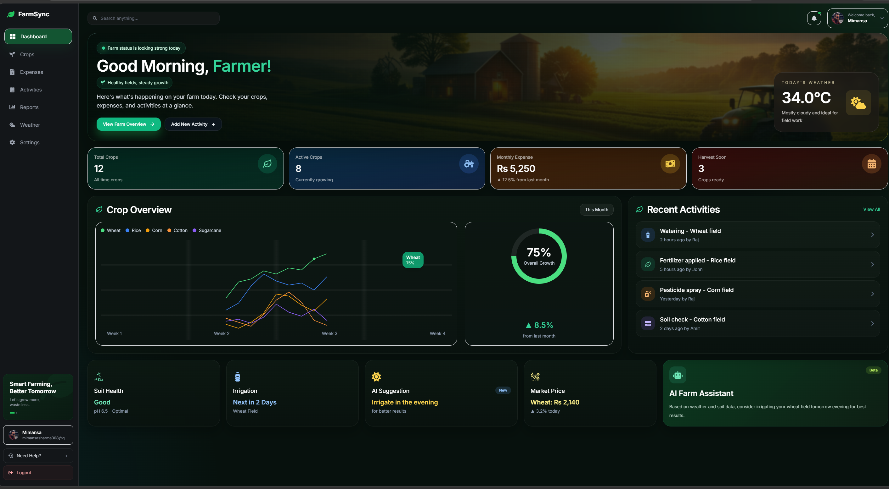
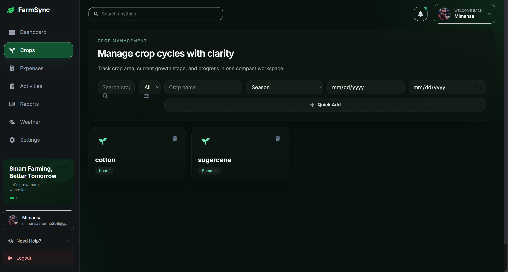
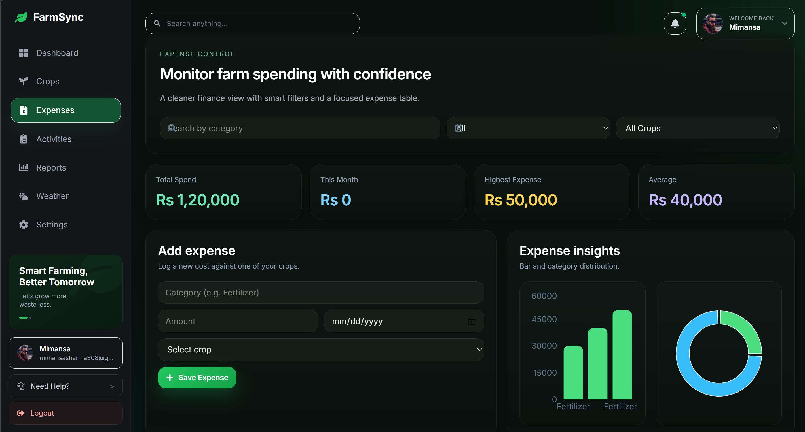
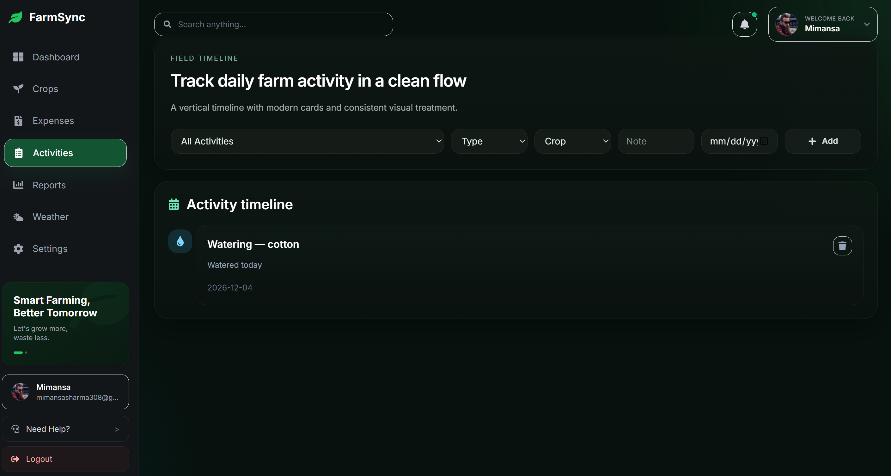
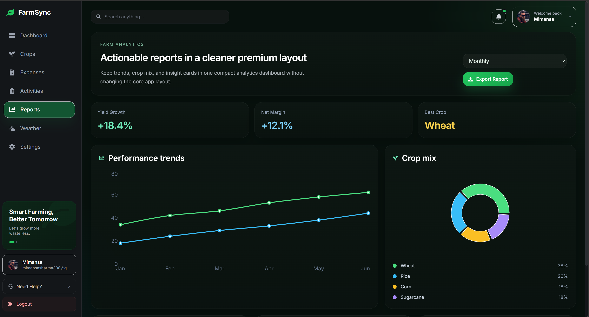
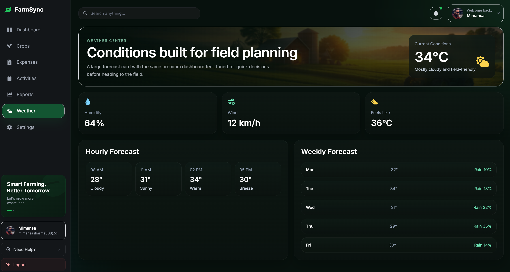
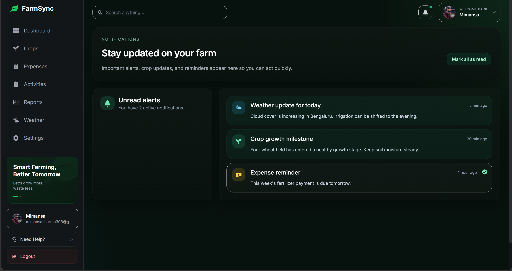

# 🌾 FarmSync – Smart Farm Management System

A modern full-stack web application that helps farmers manage crops, expenses, activities, and farm analytics in one clean dashboard.

---

## ✨ Features

- 🌱 Crop Management (track crop cycles & seasons)
- 💰 Expense Tracking (monitor spending & analytics)
- 📅 Activity Timeline (daily farm activities)
- 📊 Reports & Insights (growth, profit, trends)
- 🌦 Weather Forecast (real-time farm conditions)
- 🔔 Notifications System (alerts & reminders)
- 🤖 AI Farm Assistant (smart suggestions)
- 🔐 Authentication System (login/register)

---

## 🌐 Live Demo

🔗 https://farm-sync123.vercel.app

---

## 🖥️ Screenshots

### 🔐 Login Page

---

### 🏠 Dashboard

---

### 🌱 Crops Management

---

### 💰 Expense Tracker

---

### 📅 Activities Timeline

---

### 📊 Reports & Analytics

---

### 🌦 Weather Forecast

---

### 🔔 Notifications

---

## 🛠️ Tech Stack

### Frontend
- React.js
- Tailwind CSS
- Chart.js / Recharts

### Backend
- Spring Boot (Java)
- REST APIs

### Database
- MySQL

### Deployment
- Frontend → Vercel
- Backend → Render

---

## 👩‍💻 Team

- 👩‍💻 **Mimansa Sharma** – Team Lead  
- 👨‍💻 **Saurabh**  
- 👨‍💻 **Sayan**  
- 👨‍💻 **Lokesh**

---

## 📌 Note

This project is built for learning, innovation, and improving digital solutions for modern farming 🌾🚜
